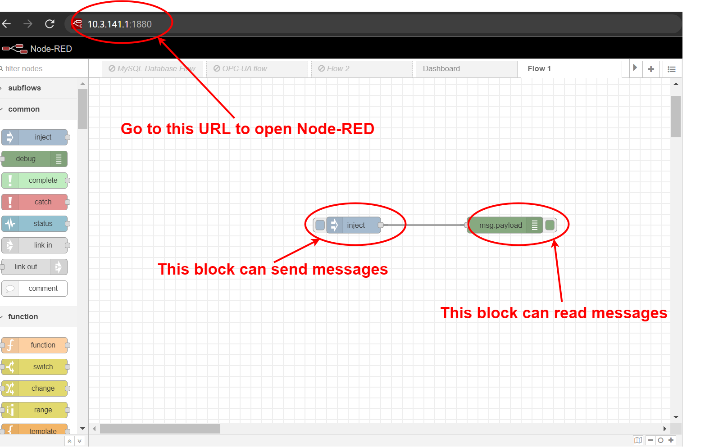
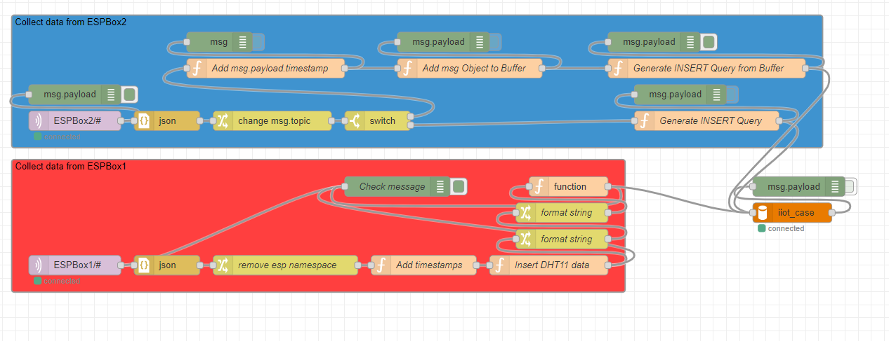

# Node-RED Guide

This is a guide on how to use and understand the currently implemented Node-RED flows. This guide will only go through the basics briefly, so it is suggested to watch this YouTube guide to get a better understanding of Node-RED (see: [Video-Guide](https://www.youtube.com/watch?v=3AR432bguOY&ab_channel=OptoVideo)).

## The Basics

Node-RED is a flowbased programming tool developed by IBM and is often times used to interface different programs and APIs with eachother. This feature is very useful, in the context of IoT and IIoT, since there are often many different devices that operate with different programming languages, interfaces and programs. Node-RED can then act as the glue tying all these technologies together. The programs made in Node-RED are known as **flows** and these **flows** consist of **nodes** that are essentially programming blocks that have different functionalities. The **nodes** usually have an input, output or both and can be chained together to give a desired output.

Node-RED is accessed through a webinterface that is usually located on port `1880`. This means that if you type the IP-address of the device, running Node-RED, into the URL field in the browser followed by `:1880` it should open Node-RED. An example of this can be seen in the Figure 1.

*Figure 1: Node-RED example flow*

Two of the most essential programming blocks can also be seen in the Figure 1. The **inject** node and the **debug** node. The **inject** node is used to send messages, timestamps or to trigger other nodes. The **debug** node is used to read messages from different parts of the flow.

Node-RED has many basic nodes for message manipulation, these nodes can sort, join and split messages. Other nodes are related to connectivity such as MQTT, TCP, UDP and HTTP built in. In the IIoT boxes the primary communication protocol used is MQTT, that is often used together with various IoT devices such as ESP32.

## The IIoT Box Flow

The IIoT Boxes currently has two flows implemented in Node-RED. Firstly, there is a data collection flow that sends the data from the sensors on the ESP Boxes into a localized database in the IIoT Box. Secondly, there is a visualization flow that is used to show an example of a dashboard that can be made from the data stored in the database.

*Figure 2: The Node-RED Data Insert Flow as of 27/09/2022.*

As shown in Figure 2., there are currently (27/09/2022) two data insert pathways; one for each ESP-box. The ESPBox1 flow concerns the DHT11 data, the ESPBox2 flow concerns the IMU and Line Tracker. The DHT11 sensor document must be parsed and correct timestamps applied, as the ESPs do not have the correct time. The resulting records are then entered into the database. A buffer is implemented for the IMU sensor data, due to the high sample rate of this sensor (50ms). The other ESPBox2 data values are entered into the relevant tables in the database based on their topic (tracker, tracker2, etc.). 
